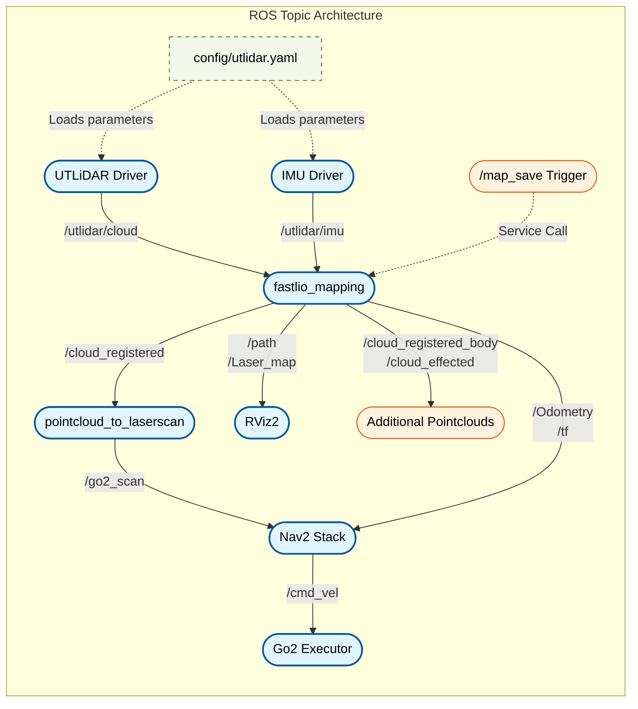

## Fork Features: Unitree Go2 Compatibility and Dockerization

> **ROS 2 Fork maintainer:** [Ericsiii](https://github.com/Ericsii)

## Fork Features: Unitree Go2 Compatibility and Dockerization

This repository integrates the Unitree Go2 with FAST-LIO and Nav2 for stable odometry, map generation, and autonomous navigation. The environment is fully dockerized.

A high-level overview can be read [here](doc/Go2_nav_doc.pdf).

### ROS Topic Architecture



### Changes and Additions
*   **launch file:** Harmonized frames with rviz standards and aligned frames with the mounted lidar.
*   **docker environment:** Includes a Dockerfile, docker-compose, Livox SDK2, livox_ros_driver2, unitree_ros2, FAST_LIO_ROS2, and a `.env` file for the network interface.
*   **config file:** Custom parameters for L1/L2.
*   **rviz file:** Customized viewer.
*   **preprocess.cpp:** Added `utlidar_handler` and a `UTLIDAR` switch case.
*   **preprocess.h:** Added `utlidar_handler` declaration, `UTLIDAR` enum value, and `utlidar_ros` namespace.
*   **nav2 yaml:** Changed robot_radius to footprint: `[ [0.35, 0.155], [0.35, -0.155], [-0.35, -0.155], [-0.35, 0.155] ]` for local and global maps.
*   **execution.py:** Added as a standalone python script for movement execution.
*   **base_link_path:** Added a python script to publish the robot center's path.
*   **master_launch.py:** Added a launch sequence which launches the executor first, then nav2, and finally fast_lio.
*   **Transformation (odom_to_camera_init):** Set pitch to -164.9ᵒ (-180ᵒ + 15.1ᵒ), which is -2.878 rad.
*   **Tracking:** Created `base_frame` for tracking the body.

Built-in LiDAR compatibility is taken from [point_lio_unilidar](https://github.com/unitreerobotics/point_lio_unilidar)

### Current Goal
*   Verify odometry stability against OptiTrack ground-truth data.

---

## Environment Setup

Build and run the Docker container, passing your specific network interface for the Go2 SDK.

*   **Build the image:**
    ```bash
    NETWORK_INTERFACE=enx00133b9a06ef docker compose build --no-cache
    ```

*   **Run the container in detached mode:**
    ```bash
    NETWORK_INTERFACE=enx00133b9a06ef docker compose up -d
    ```

To toggle CycloneDDS for online/offline use within your environment:

*   **Enable CycloneDDS:**
    ```bash
    export CYCLONEDDS_URI=file:///root/workspace/cyclonedds.xml
    ```

*   **To revert:**
    ```bash
    unset CYCLONEDDS_URI
    ```

---

## Workflow 1: Mapping and Map Conversion

First, generate the 3D point cloud map, then convert it to a 2D PGM format for Nav2.

1.  **Launch FAST-LIO and drive the robot manually to map the area:**
    ```bash
    ros2 launch fast_lio mapping.launch.py config_file:=utlidar.yaml use_sim_time:=false
    ```

2.  **Save the map as a .pcd file:**
    ```bash
    ros2 service call /map_save std_srvs/srv/Trigger
    ```

Before converting the PCD to a 2D occupancy grid, ensure your `/root/workspace/src/pcd2pgm/config/pcd2pgm.yaml` is configured correctly for your environment:

```yaml
pcd2pgm:
  ros__parameters:
    pcd_file: /root/workspace/src/fast_lio_go2/nav2/map.pcd
    odom_to_lidar_odom: [0.0, 0.0, 0.0, 0.0, 3.35, 0.0] 
    flag_pass_through: false
    map_resolution: 0.05
    map_topic_name: map
    thre_radius: 0.1
    thre_z_max: 5.0
    thre_z_min: 0.01
    thres_point_count: 1
```

3.  **Broadcast the converted map:**
    ```bash
    ros2 launch pcd2pgm pcd2pgm_launch.py
    ```

4.  **Save the broadcasted map to disk (run in a separate terminal):**
    ```bash
    ros2 run nav2_map_server map_saver_cli -f /root/workspace/src/fast_lio_go2/nav2/global_map
    ```

5.  **Verify the generated PGM visually:**
    ```bash
    eog /root/workspace/src/fast_lio_go2/nav2/global_map.pgm
    ```

---

## Workflow 2: Autonomous Navigation

To run the entire navigation stack with the pre-recorded map, use the master launch file. This handles the executor, Nav2, and FAST-LIO automatically.

*   **Launch the master sequence:**
    ```bash
    ros2 launch src/fast_lio_go2/nav2/master_launch.py network_interface:=enx00133b9a06ef
    ```

*   **Send a manual goal pose via terminal (or use RViz '2D Goal Pose'):**
    ```bash
    ros2 topic pub --once /goal_pose geometry_msgs/msg/PoseStamped "{header: {stamp: {sec: 0, nanosec: 0}, frame_id: 'map'}, pose: {position: {x: 1.0, y: 0.0, z: 0.0}, orientation: {x: 0.0, y: 0.0, z: 0.0, w: 1.0}}}"
    ```

> **Note:** For isolated Nav2 debugging without the master script, you can use: 
> `ros2 launch nav2_bringup bringup_launch.py use_sim_time:=false use_velocity_smoother:=true map:=/root/workspace/src/fast_lio_go2/nav2/global_map.yaml params_file:=/root/workspace/src/fast_lio_go2/nav2/go2_nav2_params.yaml`

---

## Simulation and Playback

To analyze past runs using ROS 2 bags, utilize simulation time to ensure RViz interprets the recorded TF data correctly.

*   **Start RViz with the custom viewer and simulation time enabled:**
    ```bash
    ros2 run rviz2 rviz2 -d install/fast_lio/share/fast_lio/rviz/fastlio.rviz --ros-args -p use_sim_time:=true
    ```

*   **Play the bag file using the simulated clock:**
    ```bash
    ros2 bag play <rosbag_name> --clock
    ```

---

# Original FAST-LIO Documentation

## Related Works and Extended Application

**SLAM:**

1. [ikd-Tree](https://github.com/hku-mars/ikd-Tree): A state-of-art dynamic KD-Tree for 3D kNN search.
2. [R2LIVE](https://github.com/hku-mars/r2live): A high-precision LiDAR-inertial-Vision fusion work using FAST-LIO as LiDAR-inertial front-end.
3. [LI_Init](https://github.com/hku-mars/LiDAR_IMU_Init): A robust, real-time LiDAR-IMU extrinsic initialization and synchronization package..
4. [FAST-LIO-LOCALIZATION](https://github.com/HViktorTsoi/FAST_LIO_LOCALIZATION): The integration of FAST-LIO with **Re-localization** function module.

**Control and Plan:**

1. [IKFOM](https://github.com/hku-mars/IKFoM): A Toolbox for fast and high-precision on-manifold Kalman filter.
2. [UAV Avoiding Dynamic Obstacles](https://github.com/hku-mars/dyn_small_obs_avoidance): One of the implementation of FAST-LIO in robot's planning.
3. [UGV Demo](https://www.youtube.com/watch?v=wikgrQbE6Cs): Model Predictive Control for Trajectory Tracking on Differentiable Manifolds.
4. [Bubble Planner](https://arxiv.org/abs/2202.12177): Planning High-speed Smooth Quadrotor Trajectories using Receding Corridors.

<!-- 10. [**FAST-LIVO**](https://github.com/hku-mars/FAST-LIVO): Fast and Tightly-coupled Sparse-Direct LiDAR-Inertial-Visual Odometry. -->

## FAST-LIO
**FAST-LIO** (Fast LiDAR-Inertial Odometry) is a computationally efficient and robust LiDAR-inertial odometry package. It fuses LiDAR feature points with IMU data using a tightly-coupled iterated extended Kalman filter to allow robust navigation in fast-motion, noisy or cluttered environments where degeneration occurs. Our package address many key issues:
1. Fast iterated Kalman filter for odometry optimization;
2. Automaticaly initialized at most steady environments;
3. Parallel KD-Tree Search to decrease the computation;

## FAST-LIO 2.0 (2021-07-05 Update)
<!--  -->
<!-- [](https://youtu.be/2OvjGnxszf8) -->
<div align="left">


</div>

**Related video:**  [FAST-LIO2](https://youtu.be/2OvjGnxszf8),  [FAST-LIO1](https://youtu.be/iYCY6T79oNU)

**Pipeline:**
<div align="center">

</div>

**New Features:**
1. Incremental mapping using [ikd-Tree](https://github.com/hku-mars/ikd-Tree), achieve faster speed and over 100Hz LiDAR rate.
2. Direct odometry (scan to map) on Raw LiDAR points (feature extraction can be disabled), achieving better accuracy.
3. Since no requirements for feature extraction, FAST-LIO2 can support many types of LiDAR including spinning (Velodyne, Ouster) and solid-state (Livox Avia, Horizon, MID-70) LiDARs, and can be easily extended to support more LiDARs.
4. Support external IMU.
5. Support ARM-based platforms including Khadas VIM3, Nivida TX2, Raspberry Pi 4B(8G RAM).

**Related papers**: 

[FAST-LIO2: Fast Direct LiDAR-inertial Odometry](doc/Fast_LIO_2.pdf)

[FAST-LIO: A Fast, Robust LiDAR-inertial Odometry Package by Tightly-Coupled Iterated Kalman Filter](https://arxiv.org/abs/2010.08196)

**Contributors**

[Wei Xu 徐威](https://github.com/XW-HKU)，[Yixi Cai 蔡逸熙](https://github.com/Ecstasy-EC)，[Dongjiao He 贺东娇](https://github.com/Joanna-HE)，[Fangcheng Zhu 朱方程](https://github.com/zfc-zfc)，[Jiarong Lin 林家荣](https://github.com/ziv-lin)，[Zheng Liu 刘政](https://github.com/Zale-Liu), [Borong Yuan](https://github.com/borongyuan)

<!-- <div align="center">
    
    
</div> -->

## 1. Prerequisites
### 1.1 **Ubuntu** and **ROS**
**Ubuntu >= 20.04**

The **default from apt** PCL and Eigen is enough for FAST-LIO to work normally.

ROS >= Foxy (Recommend to use ROS-Humble). [ROS Installation](https://docs.ros.org/en/humble/Installation.html)

### 1.2. **PCL && Eigen**
PCL    >= 1.8,   Follow [PCL Installation](https://pointclouds.org/downloads/#linux).

Eigen  >= 3.3.4, Follow [Eigen Installation](http://eigen.tuxfamily.org/index.php?title=Main_Page).

### <span id="1.3">1.3. **livox_ros_driver2**</span>
Follow [livox_ros_driver2 Installation](https://github.com/Livox-SDK/livox_ros_driver2).

You can also use the one I modified [livox_ros_driver2](https://github.com/Ericsii/livox_ros_driver2/tree/feature/use-standard-unit)

*Remarks:*
- Since the FAST-LIO must support Livox serials LiDAR firstly, so the **livox_ros_driver** must be installed and **sourced** before run any FAST-LIO launch file.
- How to source? The easiest way is add the line ``` source $Livox_ros_driver_dir$/devel/setup.bash ``` to the end of file ``` ~/.bashrc ```, where ``` $Livox_ros_driver_dir$ ``` is the directory of the livox ros driver workspace (should be the ``` ws_livox ``` directory if you completely followed the livox official document).


## 2. Build
Clone the repository and colcon build:

```bash
    cd <ros2_ws>/src # cd into a ros2 workspace folder
    git clone https://github.com/Ericsii/FAST_LIO_ROS2.git --recursive
    cd ..
    rosdep install --from-paths src --ignore-src -y
    colcon build --symlink-install
    . ./install/setup.bash # use setup.zsh if use zsh
```
- **Remember to source the livox_ros_driver before build (follow [1.3 livox_ros_driver](#1.3))**
- If you want to use a custom build of PCL, add the following line to ~/.bashrc
```export PCL_ROOT={CUSTOM_PCL_PATH}```
## 3. Directly run
Noted:

A. Please make sure the IMU and LiDAR are **Synchronized**, that's important.

B. The warning message "Failed to find match for field 'time'." means the timestamps of each LiDAR points are missed in the rosbag file. That is important for the forward propagation and backwark propagation.

C. We recommend to set the **extrinsic_est_en** to false if the extrinsic is give. As for the extrinsic initiallization, please refer to our recent work: [**Robust Real-time LiDAR-inertial Initialization**](https://github.com/hku-mars/LiDAR_IMU_Init).

### 3.1 Run use ros launch
Connect to your PC to Livox LiDAR by following  [Livox-ros-driver2 installation](https://github.com/Livox-SDK/livox_ros_driver2), then
```bash
cd <ros2_ws>
. install/setup.bash # use setup.zsh if use zsh
ros2 launch fast_lio mapping.launch.py config_file:=avia.yaml
```

Change `config_file` parameter to other yaml file under config directory as you need.

Launch livox ros driver. Use MID360 as an example.

```bash
ros2 launch livox_ros_driver2 msg_MID360_launch.py
```

- For livox serials, FAST-LIO only support the data collected by the ``` livox_lidar_msg.launch ``` since only its ``` livox_ros_driver2/CustomMsg ``` data structure produces the timestamp of each LiDAR point which is very important for the motion undistortion. ``` livox_lidar.launch ``` can not produce it right now.
- If you want to change the frame rate, please modify the **publish_freq** parameter in the [livox_lidar_msg.launch](https://github.com/Livox-SDK/livox_ros_driver/blob/master/livox_ros_driver2/launch/livox_lidar_msg.launch) of [Livox-ros-driver](https://github.com/Livox-SDK/livox_ros_driver2) before make the livox_ros_driver pakage.

### 3.2 For Livox serials with external IMU

mapping_avia.launch theratically supports mid-70, mid-40 or other livox serial LiDAR, but need to setup some parameters befor run:

Edit ``` config/avia.yaml ``` to set the below parameters:

1. LiDAR point cloud topic name: ``` lid_topic ```
2. IMU topic name: ``` imu_topic ```
3. Translational extrinsic: ``` extrinsic_T ```
4. Rotational extrinsic: ``` extrinsic_R ``` (only support rotation matrix)
- The extrinsic parameters in FAST-LIO is defined as the LiDAR's pose (position and rotation matrix) in IMU body frame (i.e. the IMU is the base frame). They can be found in the official manual.
- FAST-LIO produces a very simple software time sync for livox LiDAR, set parameter ```time_sync_en``` to ture to turn on. But turn on **ONLY IF external time synchronization is really not possible**, since the software time sync cannot make sure accuracy.

### 3.4 PCD file save

1. Enable `pcd_save.pcd_save_en` in the config file and set the `map_file_path` to the path where the map will be saved.
2. Launch the fastlio2 according to README.
3. Open RQt and switch to `Plugins->Services->Service Caller`. Trigger the service `/map_save`, then the pcd map file will be generated

```pcl_viewer scans.pcd``` can visualize the point clouds.

*Tips for pcl_viewer:*
- change what to visualize/color by pressing keyboard 1,2,3,4,5 when pcl_viewer is running. 
```
    1 is all random
    2 is X values
    3 is Y values
    4 is Z values
    5 is intensity
```

## 4. Rosbag Example
### 4.1 Livox Avia Rosbag
<div align="left">


Files: Can be downloaded from [google drive](https://drive.google.com/drive/folders/1CGYEJ9-wWjr8INyan6q1BZz_5VtGB-fP?usp=sharing)**!!!This ros1 bag should be convert to ros2!!!**

Run:
```bash
ros2 launch fast_lio mapping.launch.py config_path:=<path_to_your_config_file>
ros2 bag play <your_bag_dir>

```

### 4.2 Velodyne HDL-32E Rosbag

**NCLT Dataset**: Original bin file can be found [here](http://robots.engin.umich.edu/nclt/).

We produce [Rosbag Files](https://drive.google.com/drive/folders/1VBK5idI1oyW0GC_I_Hxh63aqam3nocNK?usp=sharing) and [a python script](https://drive.google.com/file/d/1leh7DxbHx29DyS1NJkvEfeNJoccxH7XM/view) to generate Rosbag files: ```python3 sensordata_to_rosbag_fastlio.py bin_file_dir bag_name.bag```**!!!This ros1 bag should be convert to ros2!!!** To convert ros1 bag to ros2 bag, please follow the documentation [Convert rosbag versions](https://ternaris.gitlab.io/rosbags/topics/convert.html)
    
Run:
```
roslaunch fast_lio mapping_velodyne.launch
rosbag play YOUR_DOWNLOADED.bag
```

## 5.Implementation on UAV
In order to validate the robustness and computational efficiency of FAST-LIO in actual mobile robots, we build a small-scale quadrotor which can carry a Livox Avia LiDAR with 70 degree FoV and a DJI Manifold 2-C onboard computer with a 1.8 GHz Intel i7-8550U CPU and 8 G RAM, as shown in below.

The main structure of this UAV is 3d printed (Aluminum or PLA), the .stl file will be open-sourced in the future.

<div align="center">
    
    
</div>

## 6.Acknowledgments

Thanks for LOAM(J. Zhang and S. Singh. LOAM: Lidar Odometry and Mapping in Real-time), [Livox_Mapping](https://github.com/Livox-SDK/livox_mapping), [LINS](https://github.com/ChaoqinRobotics/LINS---LiDAR-inertial-SLAM) and [Loam_Livox](https://github.com/hku-mars/loam_livox).
